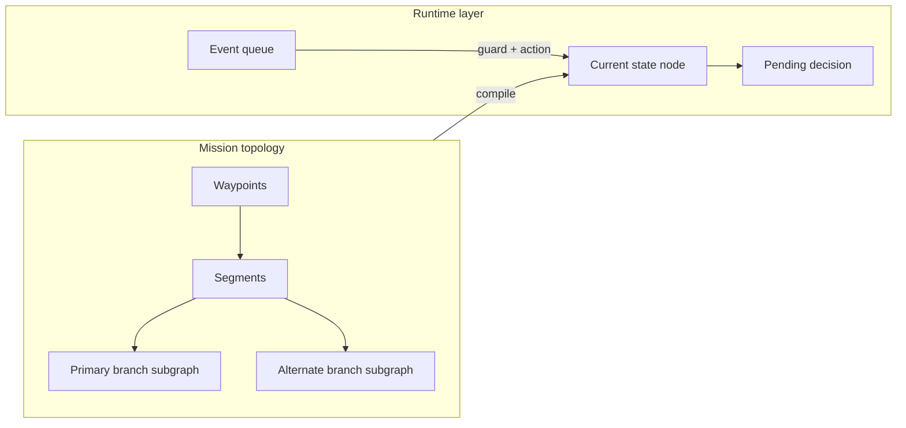

# State Machine And Decision Graph (Planning Draft)

## Purpose

Describe how **mission topology** (waypoints, segments, Primary/Alternate branches), **state nodes**, **events**, and **scanning parameters** relate for the hackathon ISR planner. The flight path is where the machine runs; the graph defines **what can happen next** when something fires—not a static outline only.

## Status

| Field | Value |
| --- | --- |
| **Review** | **REQUIRED** — content is planning draft; align with `ROUNDTABLE_DEMO_REQUIREMENTS.md` and implementation before treating as canonical. |
| **Validation** | `provisional` |
| **Last updated** | `2026-05-02` |

## Scope And Guardrails

- V1 stays ISR/recon route planning, waypoint configuration, overwatch, cue interpretation, route preview, hold, landing/recovery, RTB per roundtable guardrails.
- Simulated cues (e.g. PPS) are intent hints for command preview, not authenticated command protocol.
- Primary and Alternate are **preplanned branches** attached to a waypoint or segment, not global magic commands. Older Route A/B language is a legacy alias only.

---

## 1. Three Layers (Keep The “Outline” Honest)

| Layer | What it is | Changes when… |
| --- | --- | --- |
| **Topology** | Ordered waypoints + segments (+ optional branch subgraphs) | Operator moves points, adds segments, attaches Primary/Alternate/Hold/RTB options |
| **State nodes** | Each waypoint and each segment with custom logic maps to one or more **states** in the operator-facing outline | Same geometry; mode, triggers, or scan bundle differ |
| **Runtime** | Current state + pending decision + clocks | Sim/events advance the machine; plan edits may **recompile** outline, decision tree, and timeline |

The geographic path is not static because **transitions are labeled**: the same geometry can yield different next states depending on event, timeout, or operator choice.

---

## 2. Event → Guard → Action (Repeatable Pattern)

Use one pattern everywhere so UI, validators, and logs stay aligned:

1. **Event** — something happened (see taxonomy below).
2. **Guard** — optional checks: allowed from this node? sector/time window? validation / no-go passes?
3. **Action** — preview branch, commit transition, update scan parameters, log, highlight map zone, show rationale and warnings.
4. **Default** — timeout or “safest” branch per node configuration.

Roundtable requirements—highlighted zone, choices, route preview, rationale, warnings, confirmation—are **outputs of the action layer**, not separate ad hoc concepts.

---

## 3. Event Taxonomy (What Causes What)

Group events so wiring stays maintainable:

**Mission / plan**

- Plan loaded; plan edited → **recompile** state-machine outline, decision tree, timeline, validation.

**Motion / segment**

- Segment start; progress along corridor; inbound to waypoint.
- Obstacle or corridor violation (simulated) → obstacle subtree (hold, reroute via Primary/Alternate, RTB).

**Waypoint arrival**

- On-arrival: enter scout, scan area, observe, hold/loiter, or decision behavior as configured.

**ISR / scanning (fixture)**

- Unknown contact; classified track; cue-in-sector; dwell complete; sweep/raster complete.

**Operator**

- Confirm plan preview; choose Primary vs Alternate; override hold; acknowledge RTB.

**Simulated cue (PPS)**

- Mapped pulses use the canonical Launch Package Simulation grammar: `1 PPS` hold, `2 PPS` RTB, `4 PPS` Primary, `8 PPS` Alternate. Valid events apply the simulated branch/action immediately after guards; invalid events log a rejection. See `docs/research/pps_drone_command_mapping_plan.md`.

**Timers / thresholds**

- Decision timeout; battery/endurance threshold; max dwell for scan state.

**System / validation**

- Hard block (no-go); soft warning (still choosable); comms-loss posture (demo: scripted RTB or hold).

Each **edge** in the graph should record: **triggering events**, **disallowed events** in this node, and **timeout edge**.

---

## 4. How Decisions Relate To Each Other

**Decision nodes** should declare explicitly:

- **Entry** — which predecessor states or segments can enter (transit vs hold vs scan).
- **Inputs** — which event classes are **armed** at this node (e.g. demo: PPS + manual confirm only).
- **Outgoing** — Primary, Alternate, continue route, extend surveillance, RTB, abort; each with a preview target subgraph.
- **Coupling** — rules such as “if unknown observation open, disable auto-continue.”

Primary and Alternate branches attach to a **specific decision point** (waypoint or segment), consistent with the waypoint-queue model in `ROUNDTABLE_DEMO_REQUIREMENTS.md`.

---

## 5. Scanning Parameters Vs Flight Path

Treat **scan behavior** as parameters **bound to states** (scout, scan area, observe), not only as a separate static layer:

- **Geometry** — orbit center vs corridor raster; footprint relative to waypoint/segment.
- **Temporal** — dwell; revisit interval; “one pass then decision.”
- **Sensor / product** — width, overlap, altitude band, identification range. Default route altitude starts at `120 m AGL` via `demo_drone_route_default_altitude_agl_v1`; additional altitude bands remain warning-level until source- and formula-registered.
- **Exit conditions** — timer; detection event; operator cue; corridor complete.

The **outline** shows states such as “Transit S3 → Scan/hold at WP4 → Decision”; the **side panel** holds numeric scanning knobs for those states. Changing parameters updates validation and timeline without necessarily moving map points.

---

## 6. Conceptual Relationship Diagram

Topology edits **recompile** the compiled graph; events advance along compiled edges at runtime.

---

## 7. Next Planning Checkpoints (For Review)

1. **Canonical MVP event list** — minimum set for one-minute video vs interactive judge mode.
2. **Per objective type** — default armed events + default timeout edge (even if “continue surveillance”).
3. **Scan parameter bundle per objective** — minimal schema: dwell, pattern type, exit condition.
4. **Cue interpreter** — PPS valid only when current node allows; rejection reasons logged.
5. **Regeneration contract** — waypoint/segment/trigger edit → rebuild outline, decision tree, audit log event types (`CueEvent`, `StateTransition`, etc.).

---

## Related Documents

- `docs/ROUNDTABLE_DEMO_REQUIREMENTS.md` — MVP guardrails, waypoint vocabulary, state categories, decision UX.
- `docs/research/pps_drone_command_mapping_plan.md` — provisional PPS → command mapping and gates.
- `docs/StatePlanningForFlightPath.md` — broader doctrine-oriented notes (may overlap; ISR MVP should win where they conflict until reconciled).

## Review Notes

- **Flag:** Team review required before using this as the single source for UI labels or data model field names.
- Reconcile ambush/L-shaped content in `StatePlanningForFlightPath.md` with route-security ISR MVP when editing either file.
- Palantir/object model bindings remain open per roundtable; this doc stays integration-agnostic at the graph semantics level.
